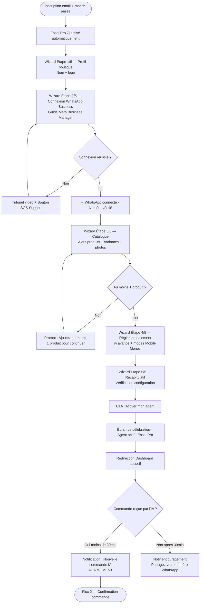
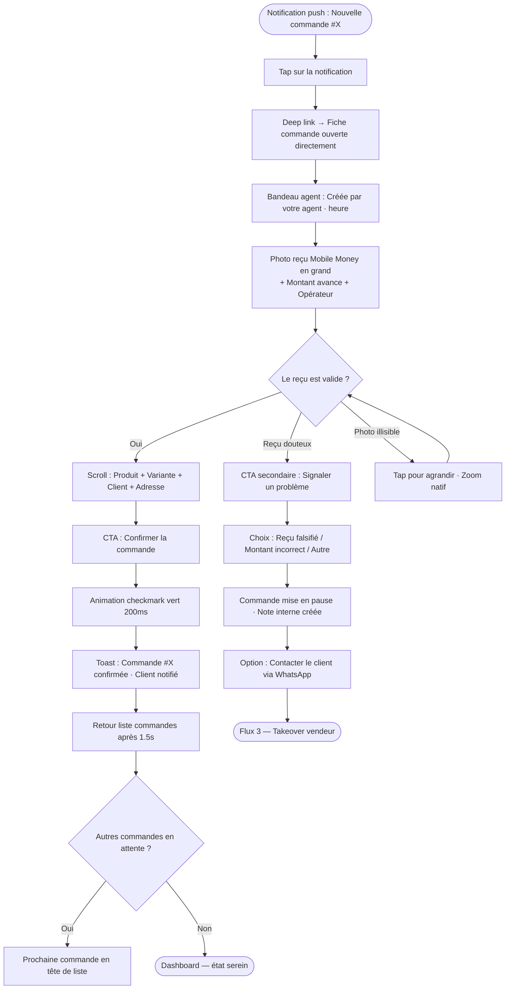
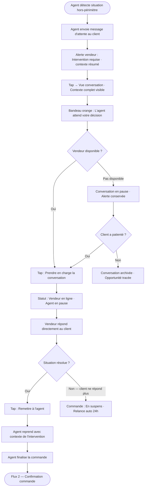
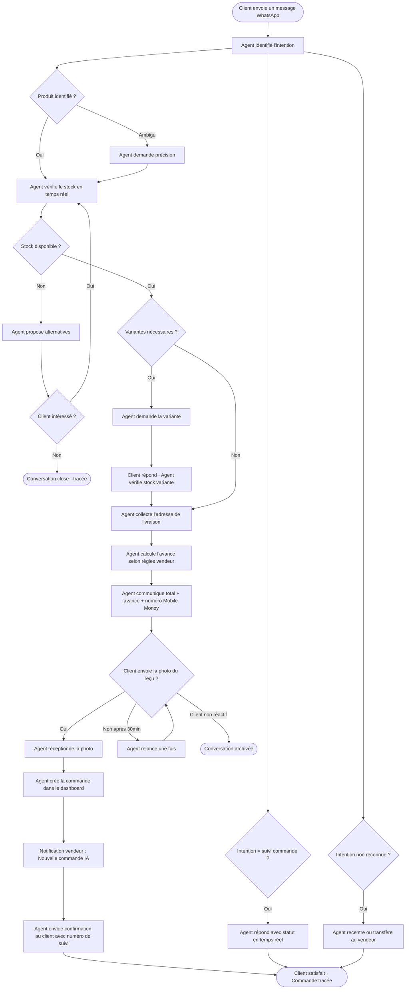

# UX Design Specification Whatsell

**Author:** Mamadou
**Date:** 2026-04-11

---

<!-- UX design content will be appended sequentially through collaborative workflow steps -->

## Résumé Exécutif

### Vision Produit

Whatsell est un SaaS de gestion commerciale conversationnelle conçu pour les petits vendeurs informels en Afrique de l'Ouest francophone (Mali, Burkina Faso). Sa promesse est radicale et simple : *"Dormez. Whatsell vend pour vous."*

Un agent IA WhatsApp actif 24h/24 prend en charge l'intégralité du processus de vente — identification d'intention, guidage des variantes, collecte de l'adresse de livraison, coordination du paiement Mobile Money, création automatique de la commande dans le dashboard. En parallèle, un dashboard mobile-first offre au vendeur une visibilité complète sur son activité commerciale.

Le moment de validation ultime : recevoir une notification de commande créée par l'IA pendant qu'on dormait ou était en cours. Ce "aha moment" est le cœur de la proposition de valeur et le pilier central de l'expérience à concevoir.

### Utilisateurs Cibles

**Boubacar — L'étudiant businessman (profil principal)**
23 ans, Bamako. Vend des sneakers importées depuis sa chambre d'université. 20–40 messages WhatsApp par jour. Perd des ventes en cours et en dormant. Son téléphone est son seul outil de travail. Besoin : une solution qui vend à sa place quand il est indisponible, sans changer ses habitudes WhatsApp.

**Aminata — La vendeuse débordée**
Boutique physique à Ouagadougou + 7 conversations WhatsApp ouvertes en simultané. Gère des exceptions (remises, situations hors-script) en temps réel entre deux clients en boutique. Besoin : reprendre le contrôle d'une conversation en un tap, gérer l'exception, puis rendre la main à l'IA.

**Fatoumata — La cliente acheteuse**
28 ans, Bamako. Découvre les produits sur Instagram, commande via WhatsApp. Ne veut pas quitter l'application. Besoin : une expérience conversationnelle fluide, naturelle, en français informel, qui aboutit à une commande confirmée sans friction.

**Mamadou — L'opérateur plateforme**
Surveille la santé technique de la plateforme, supporte les vendeurs en difficulté (token WhatsApp révoqué, problèmes d'intégration). Besoin : visibilité en temps réel sur l'état de chaque connexion vendeur et outils d'intervention rapide.

### Défis UX Clés

**1. L'onboarding Meta Business Manager — le mur critique**
La connexion du numéro WhatsApp Business via Meta Business Manager est le point de friction le plus élevé du funnel. L'UX doit transformer ce processus technique redouté en parcours guidé rassurant, avec tutoriel vidéo intégré, indicateurs de progression clairs, et filet de secours (bouton SOS support). L'objectif : première commande IA en ≤ 30 minutes post-inscription.

**2. Mobile-first sur connexion 3G / écran 360px**
L'audience cible utilise un smartphone mid-range sur connexion data mobile parfois modeste. Chaque composant doit être conçu pour 360px en priorité absolue. Les pages dashboard doivent charger en ≤ 3 secondes sur 3G. La densité d'information doit être maîtrisée — donner le sentiment de contrôle sans surcharger l'écran.

**3. La cohabitation agent IA ↔ vendeur**
Le "takeover" (reprise de contrôle d'une conversation par le vendeur) et le retour à l'IA doivent être des gestes naturels et immédiats. Le vendeur doit pouvoir intervenir en quelques secondes depuis n'importe quelle vue du dashboard, sans perdre le contexte de la conversation.

**4. La lisibilité du statut de l'agent en temps réel**
Le vendeur doit comprendre d'un coup d'œil : combien de conversations sont actives, lesquelles nécessitent son intervention, et quel est l'état de santé de son agent IA. Cette information est critique mais ne doit pas envahir l'interface.

### Opportunités Design

**1. La notification de commande comme moment émotionnel**
La notification "Nouvelle commande créée par l'IA pendant votre absence" est le cœur émotionnel du produit. Elle peut être conçue comme une mini-célébration — ton chaleureux, détail de la commande, sentiment immédiat de valeur délivrée. C'est le moment où le vendeur comprend viscéralement pourquoi il a choisi Whatsell.

**2. Le dashboard comme tableau de bord vivant**
Des visuels clairs, des données en temps réel, un sentiment de maîtrise totale depuis un smartphone. L'analytics ne doit pas être un rapport austère — c'est le miroir de l'activité du vendeur, présenté avec fierté et lisibilité.

**3. L'agent conseiller IA comme copilote business**
Une interface chat qui donne l'impression d'avoir un expert business à portée de main. "Quel est mon produit le plus vendu ce mois ?" mérite une réponse claire, visuelle si possible, et accompagnée d'une recommandation actionnable. Ce n'est pas un chatbot — c'est un partenaire.

**4. La facture PDF comme symbole de professionnalisation**
Pour beaucoup de vendeurs informels, la facture PDF générée d'un clic est leur premier document commercial formel. Cette fonctionnalité peut être présentée non comme un outil technique, mais comme une étape vers la légitimité professionnelle.

## Expérience Utilisateur Centrale

### Expérience Définissante

L'expérience centrale de Whatsell se déroule en deux temps complémentaires :

1. **L'agent travaille** — pendant que le vendeur est indisponible (en cours, en boutique,
   endormi), l'agent IA gère les conversations WhatsApp, guide les clients, collecte les
   paiements et crée les commandes de façon autonome.

2. **Le vendeur supervise et agit** — quand il reprend son téléphone, il consulte la liste
   de ses commandes, fait avancer leur statut, intervient si nécessaire, et repart confiant.

Le geste le plus répété du vendeur : ouvrir le dashboard, voir les nouvelles commandes
créées par l'IA, et les faire progresser dans le pipeline (en attente → confirmée →
en préparation → expédiée → livrée). Ce flux doit être fluide, rapide, et
satisfaisant — chaque commande avancée est une petite victoire.

### Stratégie Plateforme

- **Cible principale :** Web mobile-first — Safari/iOS et Chrome/Android
- **Résolution de référence :** 360px (smartphones mid-range Afrique de l'Ouest)
- **Contrainte réseau :** optimisé pour connexion 3G (chargement ≤ 3s)
- **Paradigme d'interaction :** 100% tactile — tap, swipe, gestes natifs
- **Pas d'app native en V1**, mais l'expérience doit se sentir native :
  transitions fluides, feedback haptique/visuel immédiat, composants
  surdimensionnés pour les doigts
- **Desktop** : supporté pour les usages occasionnels (gestion catalogue, analytics
  détaillées), mais jamais la cible prioritaire

### Interactions Sans Friction

Ces trois gestes doivent être instantanés, naturels, et ne nécessiter aucune réflexion :

1. **Prendre le contrôle d'une conversation WhatsApp**
   Un tap depuis n'importe quelle vue → le vendeur est en ligne, l'IA s'efface.
   Le contexte complet de la conversation est visible immédiatement.
   Zéro étape intermédiaire.

2. **Faire avancer le statut d'une commande**
   Depuis la liste ou le détail — un bouton d'action principal toujours visible,
   toujours accessible, sans scroll. Le statut suivant est la seule option proposée
   (pas de menu déroulant complexe).

3. **Lire l'état de son activité en un coup d'œil**
   L'écran d'accueil du dashboard livre immédiatement : commandes en attente,
   conversations actives, statut de l'agent IA, alerte de stock critique si existante.
   Pas besoin de naviguer pour comprendre l'état du business.

### Moments de Succès Critiques

**Moment #1 — La première notification de commande IA (make-or-break)**
C'est le aha moment qui définit tout. Le vendeur reçoit une notification pendant
qu'il était indisponible : "Nouvelle commande créée par Whatsell 🎉".
Ce moment doit être émotionnellement fort — ton chaleureux, détail de la commande
(produit, montant, client), sentiment immédiat que l'investissement valait la peine.
Si ce moment est terne, la promesse est brisée.

**Moment #2 — La fin de l'onboarding (activation réussie)**
L'instant où le vendeur clique sur "Activer mon agent" à l'étape 5 du wizard
est une promesse faite. L'interface doit confirmer visuellement et émotionnellement
que l'agent est en ligne et prêt à travailler. Pas un simple "Configuration terminée" —
une vraie célébration d'activation.

**Moment #3 — La reprise de contrôle seamless**
Quand Aminata intervient dans une conversation entre deux clients en boutique,
elle a 15 secondes. La reprise de contrôle doit être : notification claire,
tap unique, conversation ouverte avec contexte complet. Si c'est plus lent que ça,
elle n'utilisera plus cette fonctionnalité.

**Moment #4 — La facture PDF générée**
Pour beaucoup de vendeurs, c'est leur premier document commercial formel.
Ce moment mérite un traitement soigné — aperçu avant téléchargement,
ton de fierté dans l'interface.

### Principes d'Expérience

1. **"La commande d'abord"** — La gestion des commandes est le cœur battant
   du dashboard. Tout chemin de navigation doit y ramener en un tap maximum.

2. **"L'IA travaille, le vendeur décide"** — L'interface ne montre jamais l'IA
   comme un outil technique. Elle est présentée comme un collaborateur actif.
   Le vendeur garde toujours le sentiment d'être aux commandes.

3. **"Chaque pixel compte"** — Sur 360px avec une connexion 3G, il n'y a pas
   de place pour le superflu. Chaque élément d'interface doit justifier son
   existence par la valeur qu'il apporte au vendeur.

4. **"Les moments forts se méritent"** — Les notifications de commandes,
   les célébrations d'activation, les jalons (première commande, 10ème commande,
   premier VIP) sont des opportunités de créer un lien émotionnel durable.

5. **"Zéro ambiguïté sur l'état du système"** — Le vendeur doit toujours savoir
   si son agent est en ligne, si une conversation nécessite son attention,
   et si une alerte critique attend une réponse. L'incertitude génère de l'anxiété.

## Réponses Émotionnelles Souhaitées

### Objectifs Émotionnels Principaux

**Émotion centrale : La fluidité**
Le mot que le vendeur idéal utiliserait pour décrire Whatsell à un ami est "fluide".
Pas de friction, pas d'effort visible, pas de résistance technique. L'IA travaille
en arrière-plan — le vendeur n'a qu'à glisser d'une action à l'autre. Chaque
interaction doit renforcer cette sensation : rien ne coince, rien n'attend,
tout s'enchaîne naturellement.

**Émotions secondaires par contexte :**

| Moment | Émotion cible |
|--------|--------------|
| Première commande IA reçue | Soulagement + fierté — "Ça marche vraiment. Je suis professionnel." |
| Ouverture quotidienne du dashboard | Contrôle + sérénité — "Je sais où j'en suis. Rien ne m'échappe." |
| Agent qui gère une conversation | Confiance déléguée — "Il s'en occupe. Je peux faire autre chose." |
| Alerte d'intervention nécessaire | Clarté sans panique — "Je sais exactement quoi faire." |
| Génération d'une facture PDF | Légitimité — "Je suis un vrai commerçant." |
| Approche de la limite de tier | Fierté de progression — "J'ai autant vendu ce mois !" |

### Cartographie du Parcours Émotionnel

**Découverte & Inscription**
Curiosité → Espoir → Légère appréhension (Meta Business Manager).
L'interface doit transformer l'appréhension technique en confiance guidée :
chaque étape du wizard annonce clairement la suivante, aucune surprise.

**Onboarding (étapes 1 à 5)**
Appréhension → Progression → Anticipation → Accomplissement.
L'émotion doit monter progressivement. À l'étape 5 "Activer mon agent",
le vendeur doit ressentir l'excitation d'un lancement — pas la fin d'un formulaire.

**Premier jour actif**
Attente → Surprise positive → Soulagement → Fierté.
La première notification de commande IA est le pic émotionnel du produit.
Elle transforme un utilisateur en croyant.

**Usage quotidien**
Sérénité + Contrôle. Le dashboard est un espace calme et maîtrisé,
pas un cockpit stressant. Les informations importantes sont visibles
sans effort, les actions secondaires ne s'imposent pas.

**Gestion d'une erreur de l'IA**
Acceptance — "C'est normal, je corrige."
L'erreur ne doit pas créer de méfiance envers l'agent. Le ton de
l'interface quand une correction est nécessaire : neutre et factuel,
jamais alarmiste. Le vendeur reprend le contrôle naturellement,
corrige, et rend la main à l'IA sans friction.

**Approche de la limite de tier**
Progression et fierté, pas pression.
"Tu as traité 18 commandes ce mois — ton meilleur mois !"
L'upgrade se présente comme une opportunité de croissance,
jamais comme un mur ou une sanction.

### Micro-émotions Critiques

**Confiance vs. Scepticisme**
→ Construire la confiance dès l'onboarding : montrer l'agent "en train de
   se préparer", pas juste "configuré". Pendant les 7 premiers jours,
   un mode supervision optionnel (réponses notifiées avant envoi) permet
   au vendeur d'observer l'IA travailler et de construire sa confiance
   progressivement.

**Accomplissement vs. Frustration**
→ Chaque commande avancée dans le pipeline est une micro-victoire.
   Le feedback visuel (animation de statut, confirmation sobre) doit
   rendre ce geste satisfaisant, pas anodin.

**Sérénité vs. Anxiété**
→ Le statut de l'agent IA doit être visible en permanence sans être
   intrusif. Un indicateur simple (point vert = actif, orange = attention,
   rouge = hors ligne) suffit. L'absence d'information génère plus
   d'anxiété qu'un indicateur négatif clair.

**Progression vs. Stagnation**
→ Les jalons doivent être célébrés : première commande, 10ème commande,
   premier client VIP, premier mois à 0 rupture de stock. Ces moments
   créent un sentiment de croissance et d'appartenance au produit.

### Implications Design

- **Fluidité → animations de transition légères** entre les vues du dashboard ;
  pas de rechargements brusques, états de chargement élégants plutôt que
  spinners génériques

- **Confiance déléguée → personnification subtile de l'agent** : l'agent
  a un statut visible ("Votre agent est actif"), pas une icône technique.
  Il "travaille", il ne "tourne" pas.

- **Acceptance des erreurs → ton éditorial neutre et bienveillant** dans
  tous les messages d'erreur ou d'alerte. Jamais de majuscules alarmantes,
  jamais de rouge agressif pour les corrections mineures.

- **Fierté de progression → onboarding des limites de tier axé sur
  l'accomplissement** : la limite n'est pas un plafond, c'est un seuil
  de succès franchi.

- **Légitimité → la facture PDF mérite un aperçu soigné** avant téléchargement,
  avec le logo de la boutique bien mis en valeur. C'est un document de fierté,
  pas une sortie technique.

### Principes de Design Émotionnel

1. **"Fluide avant tout"** — Toute friction dans l'interface est une rupture
   de la promesse centrale. Chaque composant, chaque transition, chaque
   message doit contribuer à la sensation d'absence d'effort.

2. **"L'erreur est humaine, la correction est naturelle"** — Les erreurs
   de l'IA ne sont pas des échecs, elles sont des occasions de montrer
   que le vendeur reste maître. Le design ne dramatise jamais les
   corrections.

3. **"Célébrer la progression, pas l'abonnement"** — Les limites de tier
   sont présentées comme des preuves de succès commercial, pas comme
   des contraintes arbitraires.

4. **"L'agent est un collaborateur, pas un outil"** — Le langage et les
   visuels associés à l'IA doivent évoquer un partenaire de confiance.
   Il "s'occupe de", il "gère", il "travaille pour vous" — jamais il
   "exécute" ou "traite".

## Analyse UX & Inspirations

### Analyse des Produits Inspirants

**1. WhatsApp — La référence absolue de fluidité conversationnelle**

Ce que les vendeurs adorent :
- Liste de conversations avec badges non-lus : l'état de chaque échange
  est visible en un coup d'œil, sans ouvrir quoi que ce soit
- Statut de message (envoyé / reçu / lu) : feedback constant et rassurant
  sans être intrusif
- Notifications : claires, actionnables, tapables directement
- Zéro courbe d'apprentissage : les patterns sont si familiers qu'ils
  semblent naturels dès la première utilisation
- Indicateur "en train d'écrire..." : présence de l'autre côté rendue
  visible, réduisant l'anxiété d'attente

**2. Orange Maxit — La référence de confiance financière**

Ce que les vendeurs adorent :
- Écrans de confirmation de transaction : clairs, rassurants, avec
  montant en gros et statut (succès/échec) immédiatement lisible
- Hiérarchie visuelle forte : le montant est le héros de la page
- Feedback sonore + visuel à la confirmation : le double signal crée
  un sentiment de certitude
- Historique de transactions simple : liste chronologique, chaque ligne
  auto-suffisante (qui, combien, quand)
- Codes couleur intuitifs : vert = reçu, rouge = envoyé/dépensé

**3. Instagram — La référence de mise en valeur produit**

Ce que les vendeurs adorent :
- Grille produits visuellement équilibrée : les photos parlent avant
  les mots
- Fiche produit claire : photo grande, prix visible, action d'achat
  immédiatement accessible
- Scroll infini fluide : pas de pagination, pas de friction entre
  les éléments
- Barre de navigation fixe en bas : toujours accessible, jamais perdue

**4. TikTok — La référence de fluidité et d'engagement instantané**

Ce que les vendeurs adorent :
- Navigation par swipe : le geste le plus naturel sur mobile,
  aucun bouton à chercher
- Feedback visuel immédiat sur chaque interaction : micro-animations
  qui rendent chaque tap satisfaisant
- Chargement progressif invisible : le contenu suivant est déjà
  chargé avant qu'on en ait besoin
- Indicateurs de progression subtils : on sait où on en est
  sans que ça prenne de place

### Patterns UX Transférables

**Patterns de Navigation**

- **Barre de navigation fixe en bas (Instagram/TikTok)** → À adopter
  pour le dashboard Whatsell : Accueil, Commandes, Conversations,
  Catalogue, Plus. Toujours visible, toujours à portée de pouce.

- **Badges de notification sur les onglets (WhatsApp)** → Indiquer
  le nombre de commandes en attente et de conversations nécessitant
  une intervention directement sur l'onglet, sans avoir à entrer
  dans la section.

- **Navigation par swipe entre vues liées (TikTok)** → Sur la liste
  des commandes, swiper une commande pour révéler les actions rapides
  (confirmer, contacter client, voir détail) sans quitter la liste.

**Patterns d'Interaction**

- **Confirmation de transaction (Orange Maxit)** → Adapter pour les
  moments clés de Whatsell : commande créée par l'IA, statut avancé,
  facture générée. Écran de confirmation dédié avec montant en gros,
  statut clair, action suivante.

- **Indicateur "en train de traiter" (WhatsApp typing indicator)** →
  Adapter pour l'agent IA : quand l'agent est en train de répondre à
  un client, montrer un indicateur subtil dans la vue conversations du
  dashboard pour que le vendeur sache que tout se déroule bien.

- **Micro-animations de feedback (TikTok)** → Chaque action confirmée
  (statut avancé, commande validée) doit déclencher un feedback visuel
  léger — pas une animation spectaculaire, juste un signal qui dit
  "c'est fait".

- **Swipe-to-action sur les listes (patterns iOS/Android natifs)** →
  Sur la liste des commandes, un swipe vers la gauche révèle "Avancer
  le statut" comme action principale. Le geste le plus rapide pour
  l'action la plus fréquente.

**Patterns Visuels**

- **Photo en héros sur les fiches produit (Instagram)** → Dans le
  catalogue Whatsell, la photo occupe au moins 60% de la carte produit.
  Le prix et le stock disponible sont les deux seules informations
  visibles sans tap.

- **Hiérarchie des montants (Orange Maxit)** → Dans les fiches commande,
  le montant total est toujours la donnée la plus grande visuellement.
  C'est ce que le vendeur cherche en premier.

- **Statuts colorés discrets (WhatsApp)** → Adapter le système de
  couleurs pour les statuts de commande : neutre (en attente),
  bleu (confirmée), orange (en préparation), violet (expédiée),
  vert (livrée). Cohérent, intuitif, mémorisable.

### Anti-Patterns à Éviter

- **L'écran d'accueil vide au premier lancement** → Si le catalogue est
  vide, afficher un état "zéro data" motivant avec call-to-action clair.

- **La navigation profonde en arborescence** → Pas de menus hamburger
  cachés avec sous-menus. Maximum 2 niveaux de profondeur depuis
  n'importe quel endroit.

- **Les formulaires longs sans progression visible** → Le wizard
  d'onboarding affiche en permanence l'étape courante (ex: 2/5).

- **Les messages d'erreur techniques** → Jamais "Erreur 502".
  Toujours un message humain avec action proposée.

- **La surcharge d'informations sur un seul écran** → Maximum
  3 métriques clés en haut du dashboard, liste d'actions en bas.

### Stratégie d'Inspiration Design

**À Adopter directement :**
- Barre de navigation fixe en bas à 5 onglets (Instagram)
- Badges de notification sur les onglets (WhatsApp)
- Écrans de confirmation de transaction dédiés (Orange Maxit)
- Hiérarchie visuelle montant-en-héros sur les commandes (Orange Maxit)
- Photos en héros sur les fiches produit (Instagram)

**À Adapter pour Whatsell :**
- Swipe-to-action sur les listes → adapter aux statuts de commandes
- Typing indicator → adapter pour visualiser l'activité de l'agent IA
- Micro-animations de feedback → adapter à la progression des commandes,
  avec sobriété pour respecter les connexions 3G

**À Éviter absolument :**
- Navigation hamburger avec sous-menus
- Formulaires sans indicateur de progression
- Messages d'erreur techniques
- Écrans de premier lancement vides sans guidance
- Tableaux de bord denses avec 10+ métriques simultanées

## Fondation Design System

### Choix du Design System

**Approche retenue : Système thémable — Tailwind CSS + shadcn/ui**

- **Tailwind CSS** : framework utility-first, CSS généré à la demande
  (zéro style inutile chargé), paradigme mobile-first natif, performances
  optimales sur connexions 3G
- **shadcn/ui** : bibliothèque de composants copiés directement dans le
  projet (pas de dépendance externe lourde), entièrement personnalisables,
  accessibles par défaut (ARIA, navigation clavier), compatibles React,
  excellente documentation

### Justification du Choix

- **Fondateur solo** : shadcn/ui fournit des composants production-ready
  (Dialog, Sheet, Toast, Command, DataTable…) qui auraient nécessité
  des semaines de développement custom — le temps est redirigé vers
  la logique métier et l'agent IA

- **Mobile-first 360px** : Tailwind est conçu pour le responsive
  mobile-first (breakpoints `sm:`, `md:`…). Chaque composant shadcn/ui
  est construit avec des zones de tap adaptées au tactile

- **Performances 3G** : Tailwind purge automatiquement les classes
  inutilisées à la compilation — bundle CSS minimal. shadcn/ui copie
  uniquement les composants utilisés, sans overhead de librairie globale

- **Identité visuelle de marque** : le système de design tokens Tailwind
  (`tailwind.config`) centralise couleurs, typographie, espacements —
  un seul fichier à modifier pour propager l'identité Whatsell sur
  tous les composants

- **Compatibilité Safari/iOS + Chrome/Android** : composants testés
  et validés sur les deux navigateurs cibles

### Approche d'Implémentation

**Design Tokens à définir en priorité (tailwind.config) :**

| Token | Rôle |
|-------|------|
| `colors.primary` | Couleur principale Whatsell (CTA, actions primaires) |
| `colors.agent` | Couleur dédiée à l'agent IA (statut, indicateurs) |
| `colors.status.*` | Palette des statuts de commande (5 couleurs) |
| `colors.surface` | Fond des cartes et surfaces dashboard |
| `fontFamily.sans` | Police principale (lisibilité mobile) |
| `fontSize.base` | Taille de base adaptée aux écrans 360px |
| `spacing.*` | Espacements cohérents pour les zones de tap (min 44px) |
| `borderRadius` | Rayon de bordure global (cartes, boutons, badges) |

**Composants shadcn/ui à installer en priorité :**

| Composant | Usage Whatsell |
|-----------|----------------|
| `Button` | Actions primaires et secondaires dans tout le dashboard |
| `Card` | Cartes commandes, cartes produits, cartes clients |
| `Badge` | Statuts de commande, indicateurs de tier, badges de stock |
| `Sheet` | Panneaux latéraux pour les détails (commande, conversation) |
| `Dialog` | Confirmations d'actions critiques (annuler commande, révoquer accès) |
| `Toast` | Notifications temps réel (nouvelle commande IA, alerte stock) |
| `Avatar` | Fiches clients dans le CRM |
| `Progress` | Barre de progression wizard onboarding (étape X/5) |
| `Tabs` | Navigation secondaire dans les sections |
| `Command` | Interface de recherche et agent conseiller IA |
| `Skeleton` | États de chargement élégants (remplace les spinners génériques) |

**Composants custom à développer :**

| Composant | Description |
|-----------|-------------|
| `AgentStatusIndicator` | Point coloré + label statut agent (actif / attention / hors ligne) |
| `OrderStatusPipeline` | Visualisation horizontale du pipeline de statuts commande |
| `ConversationBubble` | Bulle de conversation style WhatsApp pour la vue conversations |
| `MobileNavBar` | Barre de navigation fixe en bas (5 onglets + badges) |
| `OnboardingStep` | Carte d'étape wizard avec numéro, titre, statut |
| `CelebrationToast` | Toast enrichi pour les moments forts (première commande IA, jalons) |

### Stratégie de Personnalisation

**Identité visuelle Whatsell à définir :**

- **Couleur primaire** : doit fonctionner en fond blanc ET en plein soleil
  (contraste WCAG AA minimum)
- **Couleur agent IA** : distincte de la couleur primaire pour ne
  jamais confondre actions du vendeur et actions de l'agent
- **Typographie** : sans-serif, hauteur de ligne généreuse, minimum
  16px en corps de texte (lisibilité sur petits écrans et lumière directe)
- **Statuts de commande** : 5 couleurs sémantiques mémorisables,
  accessibles pour les daltoniens (icône + label, pas couleur seule)

**Mode sombre :** non prioritaire en V1 — les vendeurs utilisent
leur téléphone en extérieur (soleil), le mode clair est la
priorité absolue.

## Expérience Utilisateur Centrale

### Expérience Définissante

**La phrase :** *"Ton agent a pris une commande. Vérifie le reçu. Confirme."*

Whatsell n'automatise pas tout — il automatise l'essentiel et laisse au vendeur
le contrôle sur ce qui compte : la validation du paiement. C'est une délégation
intelligente, pas aveugle. Le vendeur reste le décideur final, mais tout le
travail de collecte (conversation, variantes, adresse, photo du reçu) est déjà
fait par l'agent.

L'interaction définissante de Whatsell est une boucle en 4 actes :

1. **Notification** — "Nouvelle commande #247 — Nike Air Force 1 T42 — 28 000 FCFA"
2. **Ouverture directe** — tap sur la notification → fiche commande s'ouvre
   immédiatement (deep link)
3. **Vérification** — le vendeur voit la photo du reçu Mobile Money en grand,
   le montant de l'avance, les détails de la commande
4. **Confirmation** — un bouton principal "Confirmer la commande" → la commande
   passe en statut "Confirmée", le client reçoit une confirmation automatique

Ce loop peut se faire en moins de 30 secondes si l'interface est bien conçue.
Il peut aussi se faire en 2 minutes si le vendeur veut tout lire attentivement.
**La fluidité ne signifie pas la précipitation** — elle signifie que chaque
étape est claire et que rien ne ralentit inutilement.

### Modèle Mental Utilisateur

**Modèle actuel (sans Whatsell) :**
Notification WhatsApp → ouvrir WhatsApp → lire toute la conversation →
répondre manuellement → calculer l'avance → envoyer le numéro Orange Money →
attendre la photo → vérifier → noter la commande → relancer le lendemain.
*Temps estimé : 10–20 minutes par commande, disponibilité requise en temps réel.*

**Modèle cible (avec Whatsell) :**
Notification Whatsell → fiche commande ouverte directement → photo du reçu
visible immédiatement → "Confirmer" → terminé.
*Temps estimé : 30 secondes à 2 minutes, à n'importe quel moment opportun.*

**Ce que le vendeur apporte (et doit toujours apporter) :**
Le jugement sur la validité du reçu. C'est intentionnel — Whatsell ne prétend
pas remplacer le vendeur sur les décisions financières. Il prépare tout pour
que cette décision soit la plus simple et rapide possible.

### Critères de Succès de l'Expérience Centrale

- **Lisibilité immédiate du reçu** : la photo du justificatif Mobile Money
  est affichée en grand dès l'ouverture de la fiche — pas cachée sous un
  accordéon ou accessible via un lien séparé

- **Toutes les informations sur un seul écran** : produit, variante, client,
  adresse, montant total, montant avance, photo reçu — visibles sans scroll
  excessif (maximum une zone de scroll courte)

- **Action unique et claire** : un seul bouton principal "Confirmer la commande"
  dominant visuellement. L'action secondaire "Signaler un problème" est
  présente mais discrète

- **Feedback immédiat** : après confirmation, animation de succès sobre +
  toast "Commande #247 confirmée — le client a été notifié"

- **Deep link fonctionnel** : la notification ouvre directement la fiche
  commande sans passer par l'accueil du dashboard

### Analyse des Patterns UX

**Patterns établis adoptés :**

L'expérience de vérification de reçu est un pattern connu des vendeurs —
ils le font déjà sur WhatsApp. Whatsell ne réinvente pas la vérification,
il la rend plus rapide et plus claire. Le modèle mental est familier ;
l'exécution est nouvelle.

- Pattern de vérification inspiré d'Orange Maxit : montant en héros,
  statut visuel clair, action principale dominante
- Pattern de deep link notification : familier depuis les apps de
  messagerie (WhatsApp, Instagram DM)
- Pattern de liste avec swipe-to-action pour la gestion des commandes
  en série (iOS natif)

**Innovation dans les patterns établis :**

- La photo du reçu Mobile Money comme élément central de la fiche commande —
  pas une pièce jointe, mais une donnée de premier rang, aussi importante
  que le montant
- Le statut de l'agent IA visible dans le contexte de chaque commande :
  "Créée par votre agent le 11 avril à 08h43 pendant que vous étiez
  indisponible" — renforce la valeur perçue à chaque confirmation

### Mécanique de l'Expérience Centrale

**1. Initiation — La notification**

```
[Notification push]
┌─────────────────────────────────────┐
│ 🛍 Whatsell                    08h43 │
│ Nouvelle commande #247              │
│ Nike Air Force 1 T42 · 28 000 FCFA  │
│ Avance reçue · Vérification requise │
└─────────────────────────────────────┘
```
Tap sur la notification → ouverture directe de la fiche commande #247.

**2. Interaction — La fiche commande**

```
┌─────────────────────────────────────┐
│ ← Commandes          Commande #247  │
│─────────────────────────────────────│
│ 🤖 Créée par votre agent · 08h43    │
│─────────────────────────────────────│
│ JUSTIFICATIF DE PAIEMENT            │
│ ┌───────────────────────────────┐   │
│ │     [Photo reçu Orange Money] │   │
│ │     11 000 FCFA · OrangeMoney │   │
│ └───────────────────────────────┘   │
│ (tap pour agrandir)                 │
│─────────────────────────────────────│
│ COMMANDE                            │
│ Nike Air Force 1 · Taille 42        │
│ Qté : 1 · Prix : 28 000 FCFA        │
│ Avance : 11 000 FCFA (50%)          │
│ Reste à la livraison : 17 000 FCFA  │
│─────────────────────────────────────│
│ CLIENT                              │
│ Fatoumata D. · +223 7X XX XX XX     │
│ Hamdallaye ACI 2000, Bamako         │
│─────────────────────────────────────│
│                                     │
│  [ ✓ Confirmer la commande ]  ←CTA  │
│  [ ⚠ Signaler un problème   ]       │
└─────────────────────────────────────┘
```

**3. Feedback — La confirmation**

Après tap sur "Confirmer la commande" :
- Animation de checkmark vert (200ms, sobre)
- Toast : "Commande #247 confirmée · Fatoumata a été notifiée"
- Statut de la commande mis à jour : "En attente" → "Confirmée"
- Retour automatique à la liste des commandes après 1.5s

**4. Complétion — Le retour à la liste**

La liste des commandes affiche la commande #247 avec le badge
"Confirmée" en vert. La prochaine commande en attente remonte
automatiquement en tête de liste si applicable.

## Fondation Visuelle

### Système de Couleurs

**Direction retenue : "Ambition Moderne" — Indigo + Émeraude**

Rationale : l'indigo positionne Whatsell comme un SaaS professionnel crédible,
distinct de tous les concurrents (WhatsApp vert, Orange Money orange, Wave bleu
clair). L'émeraude pour l'agent IA crée une distinction claire et mémorable
entre les actions du vendeur et celles de l'agent.

**Palette Principale (Tailwind CSS tokens) :**

| Token | Valeur HEX | Usage |
|-------|-----------|-------|
| `primary` | `#6366F1` | CTAs, actions primaires, liens actifs, indicateurs de sélection |
| `primary-hover` | `#4F46E5` | État hover/pressed sur les éléments primaires |
| `primary-light` | `#EEF2FF` | Fonds de sections actives, highlights légers |
| `agent` | `#10B981` | Tout ce qui est relatif à l'agent IA (statut, badges, créé par l'agent) |
| `agent-light` | `#D1FAE5` | Fond des bandeaux "créée par votre agent" |

**Neutrals :**

| Token | Valeur HEX | Usage |
|-------|-----------|-------|
| `background` | `#F8FAFC` | Fond global de l'application |
| `surface` | `#FFFFFF` | Fond des cartes, modales, panneaux |
| `border` | `#E2E8F0` | Bordures des cartes et séparateurs |
| `text-primary` | `#0F172A` | Texte principal (titres, labels importants) |
| `text-secondary` | `#475569` | Texte secondaire (sous-titres, métadonnées) |
| `text-muted` | `#94A3B8` | Texte désactivé, placeholders |

**Couleurs Sémantiques des Statuts de Commande :**

| Statut | Couleur | HEX | Icône associée |
|--------|---------|-----|----------------|
| En attente | Gris ardoise | `#94A3B8` | ⏳ clock |
| Confirmée | Indigo | `#6366F1` | ✓ check |
| En préparation | Ambre | `#F59E0B` | 📦 box |
| Expédiée | Bleu royal | `#3B82F6` | 🚚 truck |
| Livrée | Émeraude | `#10B981` | ✓✓ double-check |

> Note accessibilité : chaque statut combine couleur + icône + label texte.
> Jamais la couleur seule — garantie d'accessibilité pour les daltoniens.

**Couleurs d'État Système :**

| État | Token | HEX | Usage |
|------|-------|-----|-------|
| Succès | `success` | `#10B981` | Confirmations, actions réussies |
| Alerte | `warning` | `#F59E0B` | Stock bas, approche limite tier |
| Erreur | `error` | `#EF4444` | Agent hors ligne, erreur critique |
| Info | `info` | `#3B82F6` | Notifications informatives |

**Vérification Contraste WCAG AA :**

| Combinaison | Ratio | Résultat |
|-------------|-------|---------|
| `text-primary` (#0F172A) sur `background` (#F8FAFC) | 17.5:1 | ✅ AAA |
| `primary` (#6366F1) sur `surface` (#FFFFFF) | 4.6:1 | ✅ AA |
| `agent` (#10B981) sur `surface` (#FFFFFF) | 3.2:1 | ✅ AA (grands textes) |
| Texte blanc sur `primary` (#6366F1) | 4.6:1 | ✅ AA (boutons) |

### Système Typographique

**Police principale : Inter**

Rationale : Inter est conçue spécifiquement pour les interfaces numériques.
Excellente lisibilité à petite taille, hauteur de x généreuse pour les
écrans mobiles, disponible gratuitement via Google Fonts, chargement
optimisé. Rendu parfait sur Safari/iOS et Chrome/Android.

**Échelle Typographique (base 16px) :**

| Rôle | Taille | Graisse | Hauteur de ligne | Usage |
|------|--------|---------|-----------------|-------|
| `heading-xl` | 24px | 700 | 1.3 | Titre de page (ex: "Commandes") |
| `heading-lg` | 20px | 600 | 1.35 | Titre de section, montant principal |
| `heading-md` | 18px | 600 | 1.4 | Sous-titre de carte, nom produit |
| `body-lg` | 16px | 400 | 1.5 | Corps de texte principal |
| `body-md` | 14px | 400 | 1.5 | Métadonnées, labels secondaires |
| `body-sm` | 12px | 400 | 1.4 | Timestamps, texte tertiaire |
| `label` | 12px | 500 | 1.3 | Labels de formulaire, badges texte |
| `button` | 15px | 500 | 1 | Texte des boutons |

> Taille minimale : 12px — jamais en dessous pour rester lisible
> sur petit écran et en pleine lumière.
> Règle d'or : les montants FCFA utilisent toujours `heading-lg` (20px, 600).

### Fondation Espacement & Layout

**Unité de base : 4px** — tous les espacements sont des multiples de 4px.

**Échelle d'espacement :**

| Token | Valeur | Usage |
|-------|--------|-------|
| `space-1` | 4px | Espacement minimal (entre icône et label) |
| `space-2` | 8px | Espacement interne serré (padding badges) |
| `space-3` | 12px | Espacement standard interne |
| `space-4` | 16px | Padding standard des cartes |
| `space-5` | 20px | Espacement entre sections d'une carte |
| `space-6` | 24px | Espacement entre cartes |
| `space-8` | 32px | Espacement majeur entre blocs |

**Zones de Tap :** minimum 44×44px — boutons d'action primaires : 48px hauteur.

**Grid Mobile (360px) :**
- Marges latérales : 16px · Contenu utile : 328px
- Grille 2 colonnes produits : 2×(158px) · Gouttière : 12px

**Grid Desktop (1280px+) :**
- Sidebar : 240px fixe · Contenu : fluide · Padding : 32px

**Rayon de Bordure :**

| Élément | Valeur | Token Tailwind |
|---------|--------|----------------|
| Boutons | 8px | `rounded-lg` |
| Cartes | 12px | `rounded-xl` |
| Badges | 9999px | `rounded-full` |
| Images produit | 8px | `rounded-lg` |
| Modales/Sheets | 16px (haut) | `rounded-t-2xl` |

### Considérations d'Accessibilité

- Contraste minimum 4.5:1 texte normal, 3:1 grands textes — WCAG AA respecté
- Statuts commande : couleur + icône + label (jamais couleur seule)
- Taille texte minimum : 12px interface, 16px corps principal
- Zones de tap minimum 44×44px sur tous les éléments interactifs
- Feedback haptique sur actions importantes (confirmation commande, activation agent)
- Palette validée usage extérieur plein soleil (ratios >7:1 textes principaux)

## Décision de Direction Design

### Directions Explorées

6 directions visuelles ont été générées et explorées via le fichier
`ux-design-directions.html`, couvrant les écrans principaux de Whatsell :

| Direction | Approche | Écrans couverts |
|-----------|----------|-----------------|
| A — Cards Épurées | Cards blanches aérées, accent indigo | Dashboard, fiche commande, succès |
| B — Dense & Efficace | Liste compacte, haute densité | Dashboard liste, commandes multiples |
| C — Hero Stats | Header indigo, grands chiffres | Dashboard motivation, progression |
| D — Conversations | Vue WhatsApp + takeover | Conversations, intervention vendeur |
| E — Analytics | Charts, métriques visuelles | Analytics, top produits |
| F — Onboarding | Wizard guidé + activation | Étapes 1-5, écran d'activation |

### Direction Retenue

**Approche hybride basée sur les 6 directions explorées**, avec les
éléments dominants suivants :

- **Layout principal (Direction A)** : cards blanches aérées pour les
  commandes, fiche commande avec photo reçu en héros, écrans de succès
  dédiés — c'est le squelette du dashboard quotidien
- **Header accueil (Direction C)** : bloc indigo en haut de l'accueil
  avec les métriques clés (CA du mois, commandes en attente, statut agent)
  — crée la fierté de progression à chaque ouverture
- **Vue conversations (Direction D)** : liste des conversations WhatsApp
  avec indicateurs IA et takeover visible — accès central depuis la
  nav bar
- **Analytics (Direction E)** : mini-bars visuelles + top produits dans
  la section analytics — léger mais informatif

### Justification Design

- La **Direction A** comme base garantit la fluidité de l'expérience
  définissante (notification → fiche commande → vérification → confirmation)
- Le **header hero de la Direction C** transforme l'accueil en tableau
  de bord motivant — renforce l'émotion centrale de fierté et contrôle
- La **Direction D** pour les conversations répond directement au besoin
  d'Aminata : voir les conversations IA et prendre le contrôle en un tap
- La **Direction F** (onboarding) est adoptée telle quelle — le wizard
  5 étapes avec progression visible et écran de célébration d'activation

### Approche d'Implémentation

**Ordre de développement des écrans :**

1. Onboarding wizard (5 étapes) — critique pour l'activation
2. Dashboard accueil (hero stats + liste commandes en attente)
3. Fiche commande + vérification reçu + confirmation
4. Vue conversations + takeover vendeur
5. Catalogue produits + gestion variantes
6. Analytics + CRM
7. Panel admin

## Parcours Utilisateurs Détaillés

### Flux 1 — Activation Vendeur (Boubacar)

**Objectif :** Amener le vendeur de l'inscription à sa première commande
traitée par l'IA en moins de 30 minutes.

**Point d'entrée :** Page d'inscription Whatsell
**Critère de succès :** Première notification de commande IA reçue



**Optimisations clés :**
- Étape 2 (WhatsApp) : tutoriel vidéo intégré, bouton SOS visible en permanence
- Étape 3 (Catalogue) : import photo depuis galerie mobile en 1 tap
- Étape 5 : récapitulatif visuel avant activation — le vendeur repart confiant

---

### Flux 2 — Confirmation de Commande (Expérience Définissante)

**Objectif :** Le vendeur vérifie le reçu Mobile Money et confirme la
commande en moins de 2 minutes depuis sa notification.

**Point d'entrée :** Notification push
**Critère de succès :** Commande en statut "Confirmée", client notifié



**Optimisations clés :**
- Deep link direct : zéro navigation intermédiaire
- Photo reçu en premier : donnée critique avant produit et client
- Retour automatique 1.5s : flow naturel vers la liste

---

### Flux 3 — Takeover Vendeur & Retour à l'IA (Aminata)

**Objectif :** Le vendeur intervient sur une situation hors-périmètre,
puis restitue le contrôle à l'IA.

**Point d'entrée :** Alerte "Intervention requise"
**Critère de succès :** Situation résolue, agent reprend le contrôle



**Optimisations clés :**
- Contexte complet immédiat : résumé + question bloquante en haut
- "Remettre à l'agent" symétrique à la prise de contrôle
- L'agent repart avec le contexte de l'intervention

---

### Flux 4 — Expérience Client WhatsApp (Fatoumata)

**Objectif :** Un client passe une commande complète depuis WhatsApp
sans quitter l'application.

**Point d'entrée :** Premier message du client sur le WhatsApp du vendeur
**Critère de succès :** Commande créée, confirmation envoyée



**Optimisations clés :**
- Tolérance au langage informel et fautes d'orthographe
- Relance unique après 30 min — respect du rythme client
- Numéro de suivi dans la confirmation — réduit les re-questions

---

### Flux 5 — Panel Admin & Support Vendeur (Mamadou Opérateur)

**Objectif :** L'opérateur surveille la santé de la plateforme,
détecte les problèmes des vendeurs, et intervient de façon proactive.

**Point d'entrée :** Panel Admin — vue globale plateforme
**Critère de succès :** Problèmes résolus avant que le vendeur
ne les signale lui-même

```mermaid
flowchart TD
    A([Opérateur ouvre le Panel Admin]) --> B[Vue globale : Taux autonomie IA · Temps réponse\nVendeurs actifs · MRR]
    B --> C{Alertes actives ?}
    C -->|Oui| D[Liste des alertes prioritaires]
    D --> E{Type d'alerte ?}
    E -->|Token WhatsApp révoqué| F[Fiche vendeur + Dernière activité]
    F --> G[Notification guidée au vendeur\nLien de reconnexion inclus]
    G --> H{Reconnecté dans les 2h ?}
    H -->|Oui| J([Alerte résolue · Journal mis à jour])
    H -->|Non| K[Support direct WhatsApp vers le vendeur]
    E -->|Vendeur Free à 18+/20 cmd| L[Liste comptes à fort potentiel Pro]
    L --> M[Notif in-app de conversion déclenchée\n\"Tu as traité 18 commandes ce mois !\"]
    M --> N([Vendeur invité à upgrader])
    E -->|Taux autonomie IA < 50%| O[Analyse conversations de la semaine]
    O --> P[Identification des patterns d'échec]
    P --> Q[Mise à jour prompting ou escalade technique]
    C -->|Non| R[Consultation métriques détaillées]
    R --> V{Action nécessaire ?}
    V -->|Oui| D
    V -->|Non| W([Monitoring continu])
```

**Optimisations clés :**
- Alertes proactives < 5 min : token révoqué détecté avant
  que le vendeur ne réalise que son agent est hors ligne
- Actions directes depuis la fiche alerte sans navigation supplémentaire
- Candidats Pro identifiés automatiquement pour conversion ciblée

---

### Patterns Communs aux Flux

**Patterns de Navigation :**
- Deep link systématique depuis les notifications → écran cible direct
- Retour automatique à la liste après action confirmée (1.5s)
- Breadcrumb simple : ← Section · Titre — max 2 niveaux de profondeur

**Patterns de Décision :**
- Une seule action primaire dominante par écran
- Action secondaire présente mais discrète
- Choix complexes décomposés en étapes séquentielles

**Patterns de Feedback :**
- Confirmation visuelle immédiate (animation < 200ms)
- Toast informatif avec action suivante suggérée
- Statut système toujours visible (agent actif / pause / hors ligne)

**Patterns de Récupération d'Erreur :**
- Jamais de message technique — toujours message humain + action proposée
- Erreur IA → le vendeur reprend naturellement, sans panique
- Token révoqué → notification guidée avec lien de reconnexion directe

## Stratégie des Composants

### Composants Design System (shadcn/ui — disponibles immédiatement)

| Composant | Usage Whatsell | Priorité |
|-----------|----------------|----------|
| `Button` | CTAs primaires et secondaires partout | P1 |
| `Card` | Cartes commandes, produits, clients | P1 |
| `Badge` | Statuts commande, tier, stock | P1 |
| `Toast` | Notifications temps réel, confirmations | P1 |
| `Progress` | Barre de progression wizard (X/5) | P1 |
| `Sheet` | Panneaux latéraux détail commande/conv. | P1 |
| `Dialog` | Confirmations d'actions critiques | P2 |
| `Tabs` | Filtres commandes, sections catalogue | P2 |
| `Avatar` | Fiches clients CRM | P2 |
| `Command` | Interface agent conseiller IA | P2 |
| `Skeleton` | États de chargement (remplace spinners) | P2 |
| `Input` / `Form` | Formulaires onboarding, catalogue | P1 |
| `Select` | Choix de variantes, filtres | P2 |
| `Switch` | Activation/désactivation produits, agent | P2 |

### Composants Custom (à développer)

#### 1. `MobileNavBar`

Barre de navigation fixe en bas — 5 onglets (Accueil · Commandes ·
Conversations · Catalogue · Plus), badges de notification en temps réel,
indicateur actif indigo. Hauteur 60px, zones de tap 44px minimum,
safe area iOS respectée.

**États :** `default` (gris) · `active` (indigo) · `badge` (rouge, max "9+")
**Accessibilité :** `role="navigation"`, `aria-current="page"`, labels
descriptifs incluant le nombre (`"Commandes, 4 en attente"`)

#### 2. `AgentStatusIndicator`

Point coloré animé + label court, visible sur l'accueil et optionnellement
dans la nav. Mise à jour temps réel via WebSocket.

**États :** `active` (vert pulsant) · `busy` (vert fixe + nb convs) ·
`attention` (orange) · `offline` (rouge, cliquable → reconnexion) ·
`paused` (gris)
**Accessibilité :** `role="status"`, `aria-live="polite"` (assertive si offline)

#### 3. `OrderStatusPipeline`

5 nœuds horizontaux reliés — En attente → Confirmée → En préparation →
Expédiée → Livrée. Nœuds passés colorés, actuel pulsant, futurs gris.

**Variantes :** `compact` (icônes seules, liste) · `full` (icônes + labels, détail)
**Interaction :** tap sur nœud suivant = raccourci pour avancer le statut

#### 4. `ConversationBubble`

Bulle de message WhatsApp-like avec distinction visuelle client / agent IA /
vendeur.

**Variantes :** `client` (blanc, gauche) · `agent` (indigo, droite) ·
`vendor` (ambre clair, droite) · `system` (gris centré, italique)
**Accessibilité :** `aria-label` descriptif sur chaque bulle

#### 5. `ReceiptViewer`

Photo du reçu Mobile Money comme élément central de la fiche commande.
Overlay bas avec montant + opérateur. Zoom pinch full screen natif.

**États :** `loading` (skeleton) · `loaded` · `fullscreen` · `missing` ·
`error` (bouton réessayer)
**Sécurité :** image via URL signée — jamais d'URL publique directe

#### 6. `OnboardingStep`

Carte d'étape wizard avec numéro, titre, état (complétée/active/à venir).

**États :** `completed` (vert, checkmark) · `active` (indigo, bordure) ·
`upcoming` (gris neutre) · `locked` (cadenas)
**Interaction :** étapes complétées cliquables pour y revenir

#### 7. `CelebrationToast`

Toast étendu pour les moments forts — durée 5s, animation expressive.
Maximum 1 par session pour préserver l'impact émotionnel.

**Déclencheurs :** Première commande IA · Activation agent · 10ème commande ·
Premier client VIP · Upgrade Pro

#### 8. `TakeoverBar`

Barre contextuelle fixe dans la vue conversation pour les prises de
contrôle vendeur.

**États :** `intervention-required` (ambre) · `vendor-in-control` (indigo) ·
`agent-resuming` (transitoire 2s)
**Comportement :** remplace le champ de saisie en état `intervention-required`

### Stratégie d'Implémentation

**Phase 1 — Composants critiques (Flux 1 & 2) :**

| Composant | Flux | Raison |
|-----------|------|--------|
| `MobileNavBar` | Tous | Navigation de base — requis avant tout |
| `OnboardingStep` | Flux 1 | Premier écran à construire |
| `AgentStatusIndicator` | Flux 1, 2 | Visible dès l'accueil |
| `ReceiptViewer` | Flux 2 | Cœur de l'expérience définissante |
| `CelebrationToast` | Flux 1 | Aha moment — critique pour la rétention |

**Phase 2 — Composants de gestion (Flux 3 & 5) :**

| Composant | Flux | Raison |
|-----------|------|--------|
| `ConversationBubble` | Flux 3, 4 | Vue conversations |
| `TakeoverBar` | Flux 3 | Intervention vendeur |
| `OrderStatusPipeline` | Flux 2, 3 | Progression des commandes |

**Principes :**
- Tous les composants custom héritent des tokens `tailwind.config` — un seul
  fichier à maintenir pour propager l'identité visuelle
- Chaque composant développé en isolation (Storybook) avant intégration
- États ARIA intégrés dès le développement initial — jamais ajoutés après
- `ReceiptViewer` et `ConversationBubble` : skeleton systématique obligatoire

## Patterns UX de Cohérence

### Hiérarchie des Boutons

**Règle fondamentale :** un seul bouton primaire par écran, sans exception.

| Niveau | Style | Usage |
|--------|-------|-------|
| **Primaire** | Fond `primary`, texte blanc, 48px, `rounded-lg` | Action unique de l'écran |
| **Secondaire** | Bordure `primary`, texte `primary`, fond transparent | Action alternative importante |
| **Tertiaire** | Texte `primary` seul, sans fond | Navigation, annuler |
| **Destructif** | Bordure + texte `error` (#EF4444) | Actions irréversibles |
| **Ghost** | Fond gris clair, texte muted | Action désactivée ou neutre |

Bouton primaire : toujours en bas de l'écran, padding 16px.
Jamais deux boutons primaires sur le même écran.

### Patterns de Feedback

| Type | Couleur | Durée | Déclencheur |
|------|---------|-------|-------------|
| Succès | `agent-light` + icône verte | 3s | Action confirmée |
| Info | `primary-light` + icône indigo | 3s | Information contextuelle |
| Alerte | `#FFFBEB` + icône ambre | 5s | Stock bas, approche limite tier |
| Erreur | `#FEF2F2` + icône rouge | Persistant | Erreur critique |
| Célébration | `agent-light` + grande icône | 5s | Moments forts uniquement |

**Micro-interactions :**
- Tap bouton primaire → compression scale 0.97, 100ms
- Confirmation → animation checkmark 200ms ease-out
- Chargement → skeleton animé (jamais spinner seul)
- Swipe-to-action → révélation progressive avec résistance haptique

### Patterns de Formulaires

**Anatomie d'un champ :**
- Label : 12px, 500, `text-secondary`, uppercase
- Input : 48px hauteur, bordure `border`, `rounded-lg`, 16px font
- Message aide/erreur : 12px, sous le champ

**États :** `default` · `focused` (bordure + ombre indigo) · `filled` ·
`error` (bordure rouge + message humain actionnable) · `success` (checkmark)
· `disabled` (fond gris, non interactif)

**Règle messages d'erreur :** apparition au blur, jamais en temps réel.
Ton humain et actionnable — jamais "Champ invalide".

**Wizard onboarding :** barre progression visible en permanence, données
conservées entre les étapes, bouton "Continuer" activé seulement si champs
obligatoires remplis.

### Patterns de Navigation

- **Nav principale :** `MobileNavBar` fixe, 5 onglets, badges temps réel
- **Nav secondaire :** Tabs shadcn/ui pour filtrer les listes
- **Profondeur max :** 2 niveaux depuis la nav principale
- **Retour auto :** 1.5s après action confirmée → retour liste
- **Gestes :** swipe right = retour · swipe gauche sur carte = action rapide
  · pull-to-refresh sur toutes les listes

### Patterns Modales & Overlays

- **Dialog :** confirmations irréversibles uniquement — titre court, conséquence
  claire, max 2 boutons [Destructif rouge] + [Annuler tertiaire]
- **Sheet :** panneau bas pour détails rapides et agent conseiller IA —
  fermable swipe down ou tap extérieur
- **Règle :** Toast = information non-bloquante / Dialog = action irréversible

### Patterns États Vides & Chargement

Chaque section a un état vide motivant — jamais de page blanche.

| Section | Message | CTA |
|---------|---------|-----|
| Commandes | "Votre agent est prêt !" | — |
| Catalogue | "Ajoutez vos premiers produits" | "Ajouter un produit" |
| Clients | "Apparaîtront après la première commande" | — |
| Analytics | "Données disponibles après les premières commandes" | — |

**Chargement :** skeleton reproduisant la forme du contenu, délai 300ms
avant affichage, message "Connexion lente" si > 5s.

### Patterns Recherche & Filtrage

- Recherche : icône loupe dans le header, expansion animée au tap,
  filtrage temps réel (debounce 300ms)
- Filtres : Tabs pour statuts principaux, badge de compte si filtres actifs,
  "Réinitialiser" disponible
- Agent Conseiller IA : Command shadcn/ui en bottom sheet, suggestions
  pré-définies avant saisie, historique de session conservé

---

## 13. Responsive Design & Accessibilité

### Stratégie Mobile-First

Whatsell est conçu en **mobile-first** absolu. Le breakpoint de référence est **360px**
(Android entrée de gamme, le device le plus répandu parmi nos vendeurs). Chaque
composant est d'abord conçu pour 360px, puis progressivement amélioré pour les écrans
plus larges.

**Breakpoints Tailwind CSS :**

| Préfixe | Largeur | Usage |
|---------|---------|-------|
| *(base)* | 0px–639px | Mobile — expérience principale |
| `sm:` | 640px–767px | Mobile large / phablet |
| `md:` | 768px–1023px | Tablette |
| `lg:` | 1024px–1279px | Desktop compact |
| `xl:` | 1280px+ | Desktop large |

### Comportement Responsive par Composant

| Composant | Mobile (360px) | Tablette (768px) | Desktop (1024px+) |
|-----------|---------------|-----------------|-------------------|
| **MobileNavBar** | Barre fixe bas, 5 icônes | Barre fixe bas | Sidebar gauche collapsible |
| **OrderStatusPipeline** | Scroll horizontal, 5 étapes compressées | Toutes étapes visibles | Vue étendue avec labels complets |
| **ConversationBubble** | Full width, bulles 85% max | Bulles 70% max | Panneau split 40/60 |
| **ReceiptViewer** | Bottom sheet plein écran | Modal 80% hauteur | Modal centré 500px |
| **OnboardingStep** | Plein écran, un step à la fois | Centré 600px | Centré 720px, illustration côté |
| **AgentStatusIndicator** | Badge compact dans header | Badge avec texte | Badge complet avec tooltip |
| **TakeoverBar** | Bandeau fixe en bas | Bandeau fixe en bas | Bandeau dans sidebar |

### Accessibilité — Cible WCAG 2.1 AA

#### Contrastes Couleurs

| Élément | Couleur | Background | Ratio | Résultat |
|---------|---------|-----------|-------|---------|
| Texte principal | `#111827` | `#FFFFFF` | 16.1:1 | ✅ AAA |
| Texte secondaire | `#6B7280` | `#FFFFFF` | 4.6:1 | ✅ AA |
| Bouton primaire texte | `#FFFFFF` | `#6366F1` | 4.7:1 | ✅ AA |
| Bouton agent texte | `#FFFFFF` | `#10B981` | 4.5:1 | ✅ AA |
| Badge statut "livré" | `#065F46` | `#D1FAE5` | 7.2:1 | ✅ AAA |
| Texte désactivé | `#9CA3AF` | `#FFFFFF` | 2.9:1 | ⚠️ Décoratif |

#### Navigation Clavier

- Tous les éléments interactifs accessibles au clavier (`Tab`, `Shift+Tab`)
- Focus ring visible : `ring-2 ring-indigo-500 ring-offset-2`
- Ordre de focus logique (haut → bas, gauche → droite)
- Raccourci `Escape` pour fermer tous les modals et bottom sheets
- `Enter` / `Space` activent les boutons et liens

#### Sémantique HTML & ARIA

```html
<!-- Navigation principale -->
<nav aria-label="Navigation principale">
  <a href="/dashboard" aria-current="page">Tableau de bord</a>
</nav>

<!-- Statut agent -->
<div role="status" aria-live="polite" aria-label="Agent IA actif">
  <span class="sr-only">Agent WhatsApp actif</span>
</div>

<!-- Pipeline commande -->
<ol aria-label="Statut de la commande">
  <li aria-current="step">En attente de confirmation</li>
</ol>

<!-- Bottom sheet / Modal -->
<div role="dialog" aria-modal="true" aria-labelledby="modal-title">
  <h2 id="modal-title">Vérifier le justificatif</h2>
</div>
```

#### Tailles Minimales & Touch

- Zone de tap minimum : **44×44px** (recommandation Apple/Google)
- Espacement entre éléments interactifs : **8px minimum**
- Texte minimum lisible : **14px** (12px uniquement pour métadonnées)
- Taille de police système respectée (pas de blocage du zoom navigateur)

### Optimisation Performance 3G

Les vendeurs opèrent sur réseau mobile data limité — la performance est une
dimension d'accessibilité à part entière.

- **Images produits :** format WebP, lazy loading, max 200KB par image
- **CSS :** Tailwind CSS purge en production, bundle < 15KB gzippé
- **JS :** Code splitting par route, First Contentful Paint < 2s sur 3G
- **Fonts :** Inter via `font-display: swap`, subset latin + latin-ext
- **Icônes :** lucide-react (tree-shakeable), pas de sprite SVG entier
- **API :** Pagination côté serveur, skeleton loaders pour toutes les listes

### Stratégie de Test

**Appareils physiques prioritaires :**
- iPhone SE 2020 / Safari iOS (segment Apple dominant)
- Samsung Galaxy A-series / Chrome Android (360px baseline)
- Écran tablette 768px (usage dashboard étendu)

**Outils :**
- Axe DevTools (extension Chrome) — scan WCAG automatisé
- VoiceOver iOS — navigation au lecteur d'écran
- Chrome DevTools device emulation — breakpoints et throttling 3G
- Lighthouse CI — Performance, Accessibility, Best Practices

### Checklists Développeur

**Responsive — à vérifier sur chaque composant :**
- [ ] Fonctionne à 360px sans overflow horizontal
- [ ] Images ne dépassent pas leur conteneur
- [ ] Texte ne dépasse pas en dehors des bulles/cards
- [ ] Bottom sheets remontent au-dessus du clavier virtuel (iOS/Android)
- [ ] Aucun hover-only interaction (prévoir tap équivalent)

**Accessibilité — à vérifier sur chaque feature :**
- [ ] Tous les champs ont un `<label>` associé
- [ ] Les icônes seules ont un `aria-label` ou `sr-only` text
- [ ] Les messages d'erreur sont lus par `aria-live="assertive"`
- [ ] Le focus ne part pas dans le vide après fermeture d'un modal
- [ ] Score Axe DevTools : 0 erreur critique, 0 erreur sérieuse
